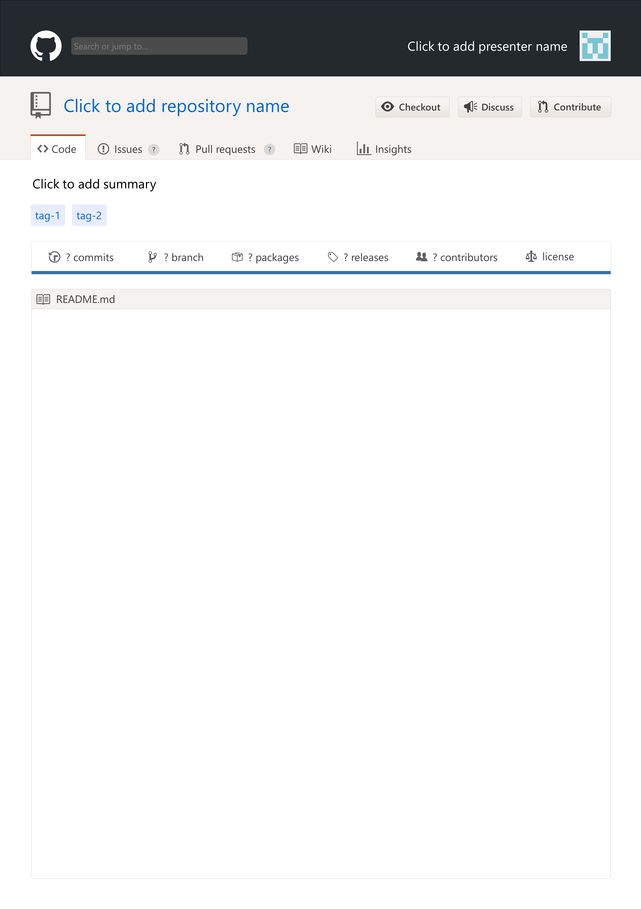

# GitHub style poster template

Academic poster PowerPoint template in a GitHub page style. Was originally used for my
poster on the
[HUPO-PSI Spectral Library Format](https://github.com/HUPO-PSI/SpectralLibraryFormat)
during the
[EuBIC 2020 Developers' Meeting](https://eubic-ms.org/events/2020-developers-meeting/):

>Gabriels, Ralf. The HUPO-PSI standardized spectral library format. (Zenodo, 2020). [doi:10.5281/zenodo.3607178](https://http://doi.org/10.5281/zenodo.3607178)

### Template preview
